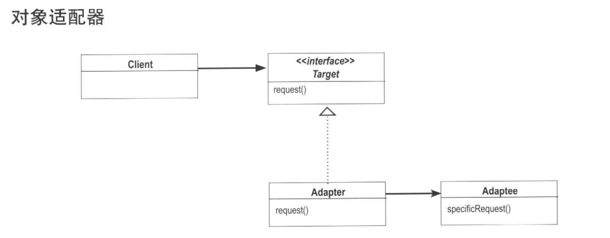
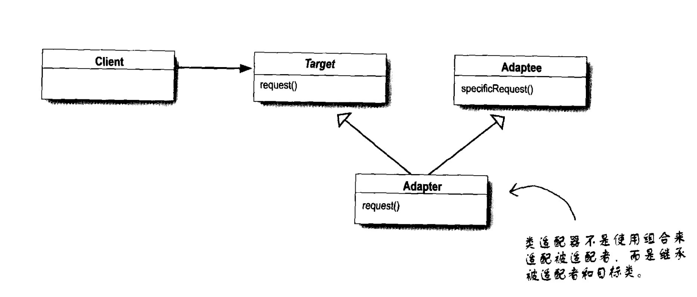
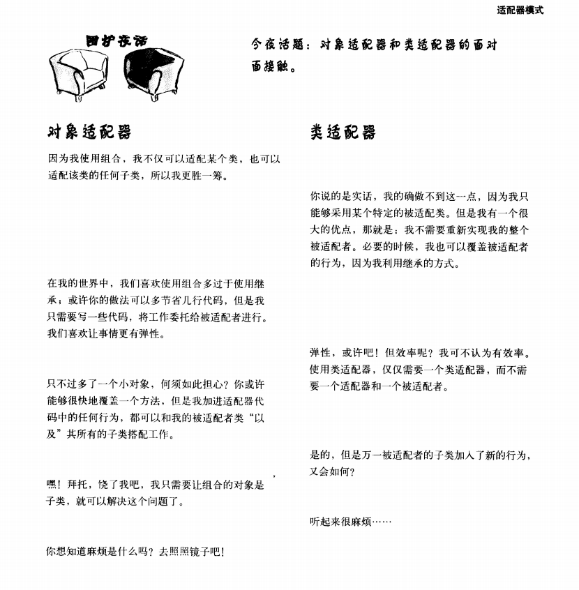

### 适配者模式

适配器模式 - 将一个类的接口，转换成客户期望的另一个接口。适配器让原本接口不兼容的类可以合作。

#### 对象适配器

#### 类适配器

和对象适配器的区别就在于适配器继承了Target和Adaptee。而对象适配器利用组合的方式将请求传送给被适配者

对象适配器和类适配器使用两种不同的适配方法（分别是组合与继承）。这两种实现的差异如何影响适配器的弹性？？

### OO
1.基础
抽象，封装，多态，继承

2.原则

- 封装变化
- 多用组合，少用继承
- 针对接口编程，不针对实现编程
- 为交互对象之间的松耦合设计而努力
- 类应该对扩展开饭，对修改关闭
- 依赖抽象，不要依赖具体类
- 只和朋友交谈

3.要点

- 当需要使用现有的类而其接口并不符合你的需求时，就使用适配器
- 当需要简化并统一一个很大的接口或则一群复杂的接口时，使用外观
- 适配器改变接口以符合客户期望
- 外观将客户从一个复杂的子系统中解耦
- 实现一个适配器可能需要一番功夫，也可能不费工夫，视目标的接口的大小和复杂度而定
- 适配器模式有两种形式：对象适配器和类适配器。类适配器需要用到多重继承
- 可以为一个子系统实现一个以上的外观
- 适配器将一个对象包装起来以改变其接口；装饰者将一个对象包装起来以增加新的行为和责任；而外观模式是将一群对象“包装”起来以简化其接口