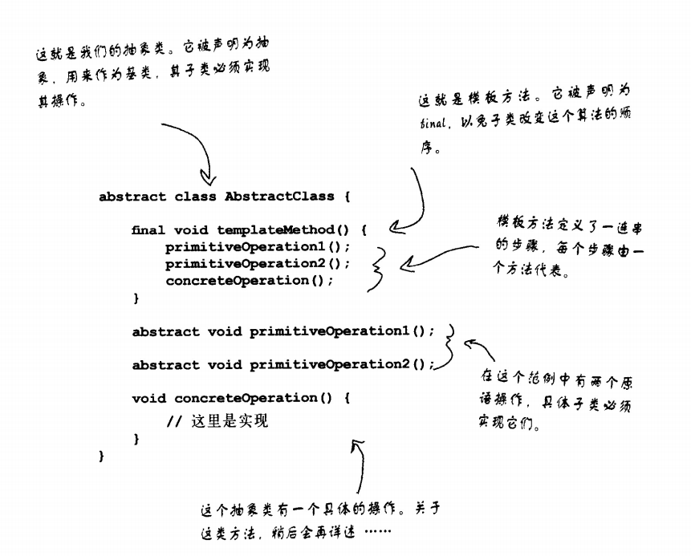
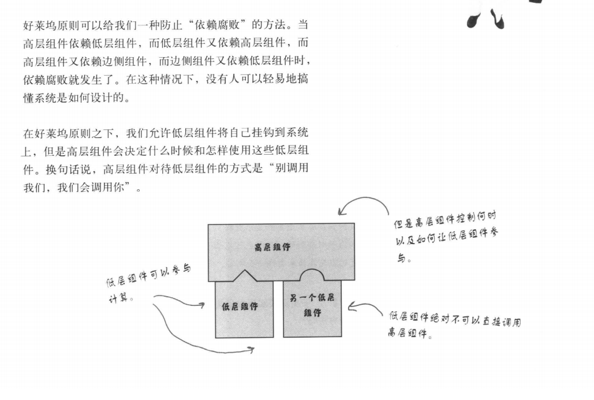

### 模板模式

模板方法模式 - 在一个方法中定义一个算法的骨架，而将一些步骤延迟到子类中。模板方法是的子类可以在不改变
算法结构的情况下，重新定义算法中的实现

#### 好莱坞原则

`别调用（打电话给）我们，我们会调用（打电话给）你`

### OO
1.基础
抽象，封装，多态，继承

2.原则

- 封装变化
- 多用组合，少用继承
- 针对接口编程，不针对实现编程
- 为交互对象之间的松耦合设计而努力
- 类应该对扩展开饭，对修改关闭
- 依赖抽象，不要依赖具体类
- 只和朋友交谈
- 别找我，我会找你

3.要点

- "模板方法"定义了算法的步骤，把这些步骤的实现延迟到子类
- 模板方法模式为我们提供了一种代码复用的重要技巧
- 模板方法的抽象类可以定义具体的方法、抽象方法和钩子
- 抽象方法由子类实现
- 钩子是一种方法，他在抽象类中不做事，或者只做模式的事情，子类可以选择要不要去覆盖它。
- 为了防止子类改变模板中的算法，可以选择要不要去覆盖它
- 为了防止子类改变模板方法中的算法，可以将模板模板方法声明为final。
- 好莱坞原则告诉我们，将决策权放在高层模块中，以便决定如何以及何时调用底层模块
- 你将在真实世界中看到模板方法的许多变体，不要期待他们全都是一眼就可以被你认出的。
- 策略模式和模板方法模式都封装了算法，一个用组合，一个用继承
- 工厂方法是模板方法的一种特殊版本

